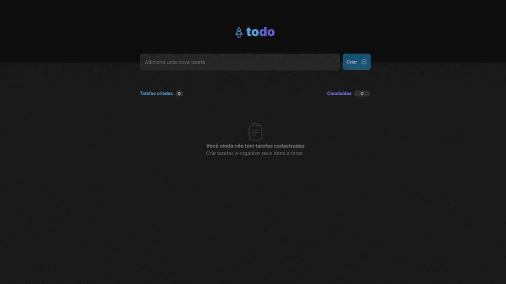
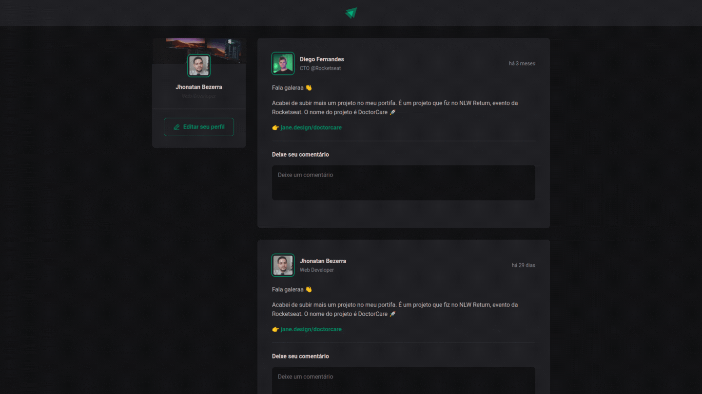

  

  

  
  
<strong>Segundo o proprio site, REACT é uma biblioteca javascript para criar interfaces de usuários.</strong>

  
  
Components(Componentes)

  
JSX(JS + XML)

  
State(estados)

  
Props(propriedades)

 
  

  

  

  
  
  

  
  ## Tecnologias:
  
  

    
    
    
    
    
    
  

  
  ## Links:
  
  

      
      
  

  
  

  
  

  
    

  
  ## Tecnologias:
  
  

    
    
    
    
    
    
  

  
  ## Links:
  
  

      
      
  

   

  
  

  
    

  
  ## Tecnologias:
  
  

    
    
    
    
    
    
  

  
  ## Links:
  
  

      
      
  
      
  

