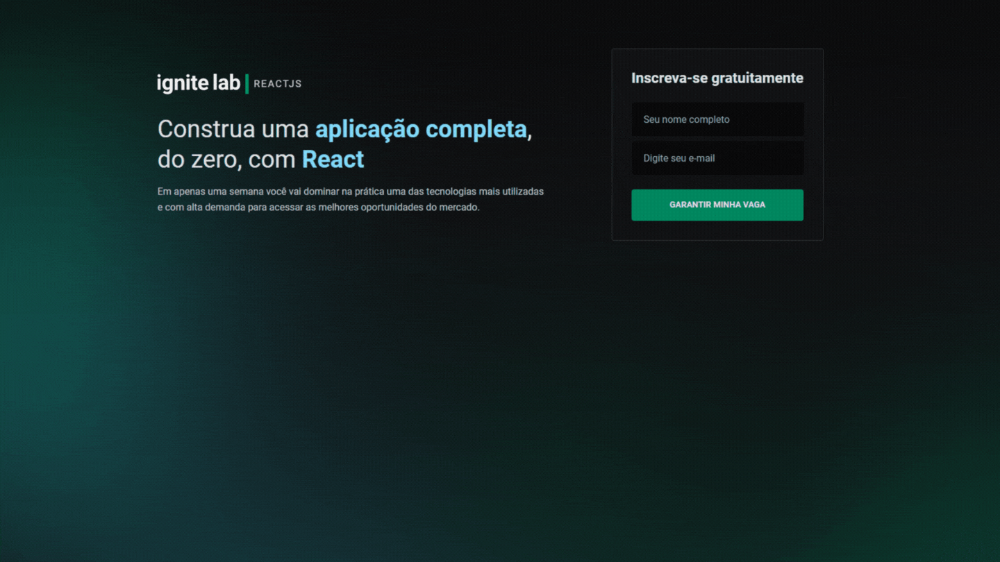

  
  
  
  

  
  
<strong>Segundo o proprio site, REACT é uma biblioteca javascript para criar interfaces de usuários.</strong>

  
  
Components(Componentes)

  
JSX(JS + XML)

  
State(estados)

  
Props(propriedades)

  
  

  
  

  
  

